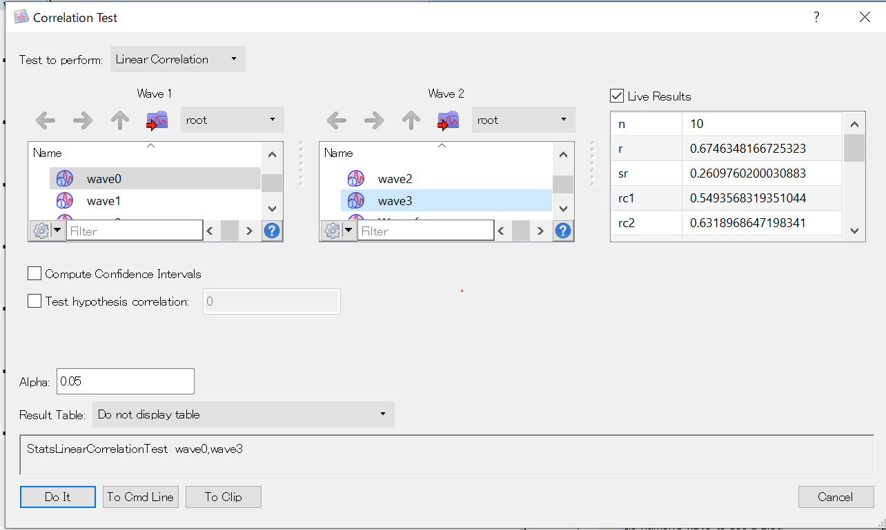

## Igor proで線形回帰  
以下は私の備忘録です. 論文書いていて, 線形回帰をしたかった時に必要だったので  
  
最終目標は以下のようなグラフを作成すること  
  

0. 用意するもの  
x座標にあたるデータ (wave), y座標にあたるデータ (wave)
  

1. Correlation analysis  
まずは Statistics/Correlation analysisで相関解析を行います.  
ここではr=0との検定 (無相関ではないことの検定) とr(相関係数) の計算などが行えます.  
別にIgorで行わなくてもいいですが, あとのグラフ化と一緒にできると楽なので
  
Live resultでp value見れます.  

2.Scatter plot  
これは単純にWindow/New graphで  
X軸の値とy軸の値を選択して適当にplot  

最初は上のような変なグラフですが, 見た目を調整すれば大丈夫

3. 回帰直線のプロット  
回帰直線のプロットはcurve fitで行います. (ほかのやり方もあるかもですが, 今のところ知りません)  
```Igor
CurveFit line wave0 /X=wave3 /D /F={0.95, 1}
```    
line: 直線でfit  
wave0: fitする値 (scatter plot)のy軸の値  
/X=wave3: scatter plotのx軸
/D: 倍精度
/F={0.95, 1}: 信頼区間の計算について, 1つ目の値は何%信頼区間を計算するか (普通は95%)  
2つめの値は計算のモード, 1だと回帰直線の95%信頼区間のみ, 予測区間を出したければ別のコマンド  
上記で実行すれば回帰直線と, 95%信頼区間がプロットされるはず  